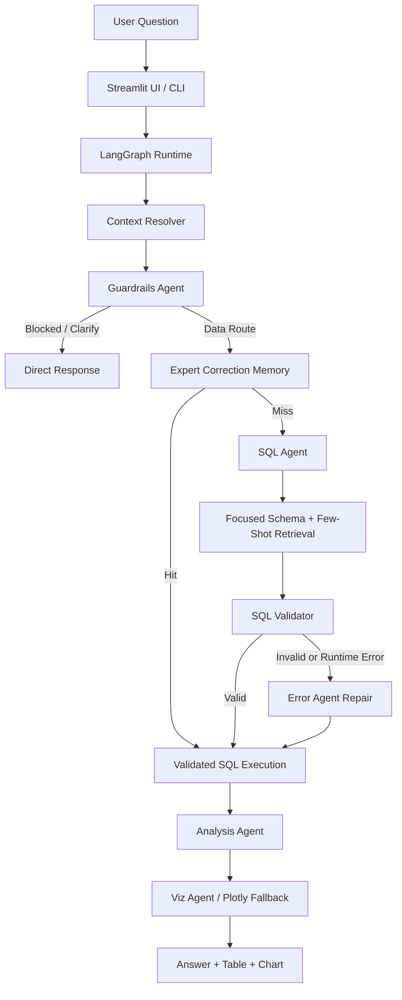

# Projet_Statapp

StatApp is a local Text-to-SQL chatbot built on top of a SQLite database containing three core business tables: `clients`, `dossiers`, and `transactions`.

The application turns a natural-language question into:

- a safe SQL query,
- a database result,
- a concise natural-language answer,
- an optional Plotly visualization,
- and, when needed, an expert-reviewed correction reusable on future similar questions.

## Documentation

- Architecture and runtime flow: `docs/ARCHITECTURE.md`
- Repository structure: `docs/STRUCTURE.md`
- Configuration tracker: `docs/CONFIG_TRACKER.md`
- Function-level reference: `docs/FUNCTIONS.md`

## Current Architecture at a Glance



Primary runtime path:

- `streamlit_app.py` and `app/main.py` both use the LangGraph pipeline.
- The SQL step uses a focused schema plus local few-shot retrieval.
- Expert-reviewed SQL can be reused before asking the model to generate fresh SQL.

## Requirements

- Python `3.12`
- a virtual environment in `.venv`
- one configured LLM provider in `.env`

## Setup

Create and activate the virtual environment:

```bash
python3.12 -m venv .venv
source .venv/bin/activate
python --version
```

Install dependencies:

```bash
pip install -r requirements.txt
```

Create your environment file:

```bash
cp .env.example .env
```

Then set the provider-specific values in `.env`:

- `LLM_PROVIDER`
- `LLM_MODEL`
- the corresponding API key when using OpenAI or Google

If you want to use Ollama, pull the model first, for example:

```bash
ollama pull sqlcoder:7b
```

## Build the SQLite Database

If you start from the CSV files, generate the SQLite database with:

```bash
python scripts/build_sqlite_db.py \
  --client_csv data/client.csv \
  --dossier_csv data/dossier.csv \
  --transaction_csv data/transaction.csv \
  --sqlite data/statapp.sqlite
```

## Run the Application

Streamlit UI:

```bash
streamlit run streamlit_app.py
```

CLI:

```bash
python -m app.main --db data/statapp.sqlite --question "How many clients by segment?"
```

## Tests

Automated tests:

```bash
PYTEST_DISABLE_PLUGIN_AUTOLOAD=1 python -m pytest tests -q
```

`tests/` is the authoritative automated suite.

Manual exploratory helpers live in:

- `scripts/manual/`
- `scripts/setup/`

## Useful Local Checks

Inspect the SQLite database:

```bash
sqlite3 data/statapp.sqlite ".tables"
sqlite3 data/statapp.sqlite "SELECT COUNT(*) FROM transactions;"
```

Inspect the schema and run a direct query:

```bash
python -c "from app.db.sqlite import get_schema_text, run_query; print(get_schema_text('data/statapp.sqlite')); cols, rows = run_query('data/statapp.sqlite', 'SELECT COUNT(*) AS n FROM clients'); print(cols, rows)"
```

Check SQL safety rules:

```bash
python -c "from app.safety.sql_validator import validate_sql; print(validate_sql('SELECT prenom FROM clients LIMIT 1')); print(validate_sql('SELECT date_naissance FROM clients LIMIT 1')); print(validate_sql('SELECT client_id, commune FROM clients LIMIT 1'));"
```

Smoke-test SQL generation:

```bash
python -c "from app.db.sqlite import get_prompt_schema_text; from app.agents.sql.agent import SQLAgent; from app.safety.sql_validator import validate_sql; from app.pipeline.execute_sql import execute_sql; q = 'How many clients are there by segment_client?'; schema = get_prompt_schema_text('data/statapp.sqlite', q); agent = SQLAgent(); sql = agent.generate_sql(q, schema); print('SQL:', sql); print('VALID:', validate_sql(sql)); print(execute_sql('data/statapp.sqlite', sql))"
```

## Notes

- Expert-reviewed SQL corrections are stored in `corrections_log` and can be reused automatically.
- The prompt path now uses a question-focused schema via `get_prompt_schema_text(...)` instead of always injecting the full schema.
- SQL few-shot retrieval is local and lightweight: curated examples live under `app/agents/sql/` and can be written into `data/rag_examples.json`.

## Repository Tree

```text
Projet_Statapp/
  .env.example
  EDA_StatApp.ipynb
  README.md
  app/
    __init__.py
    constants.py
    logging_utils.py
    main.py
    messages.py
    agents/
      __init__.py
      analysis_agent.py
      error_agent.py
      viz_agent.py
      guardrails/
        __init__.py
        agent.py
        gatekeeper.py
        prompts.py
        router.py
        schemas.py
      shared/
        __init__.py
        config.py
      sql/
        __init__.py
        agent.py
        example_bank.py
        prompt.py
        retrieval.py
    db/
      __init__.py
      corrections.py
      sqlite.py
    formatters/
      __init__.py
      format_response.py
      viz_plotly.py
    llm/
      __init__.py
      factory.py
    pipeline/
      __init__.py
      chatbot_orchestrator.py
      conversation_state.py
      data_pipeline.py
      execute_sql.py
      expert_review.py
      langgraph_flow.py
    safety/
      __init__.py
      sql_validator.py
  data/
    100_Questions_SQL.xlsx
    Dictionnaire_Donnees.xlsx
    client.csv
    dossier.csv
    statapp.sqlite
    transaction.csv
  docs/
    ARCHITECTURE.md
    CONFIG_TRACKER.md
    FUNCTIONS.md
    STRUCTURE.md
    diagrams/
      README.md
      project_architecture.mmd
      project_architecture.svg
      runtime_flow.mmd
      runtime_flow.svg
    references/
      ...
  logs/
    build_db_meta.json
  scripts/
    __init__.py
    build_sqlite_db.py
    sanity_checks.py
    manual/
      data_pipeline_check.py
      router_check.py
      safety_check.py
    setup/
      seed_sql_examples.py
  streamlit_app.py
  tests/
    fixtures/
      conversation_regressions.json
    test_conversation_regressions.py
    test_data_pipeline.py
    test_expert_review.py
    test_format_response.py
    test_guardrails.py
    test_langgraph_flow.py
    test_llm_factory.py
    test_retrieval_helpers.py
    test_sql_agent.py
    test_sql_validator.py
    test_viz_plotly.py
  pytest.ini
  requirements.txt
```
